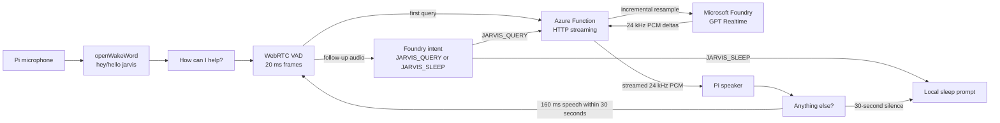

# Architecture

## Runtime path



The Pi owns only physical audio, wake detection, local session prompts,
follow-up timing, turn termination, and playback. The Function owns protocol
validation, authentication, resampling, Microsoft Entra token acquisition, and
the Realtime session. GPT Realtime owns speech understanding, response
generation, and speech synthesis in one model session.

## Pi state machine

```text
IDLE_WAKEWORD
  -> ACTIVATED
  -> STREAMING_COMMAND
  -> WAITING_FOR_RESPONSE
  -> PLAYING_RESPONSE
  -> STREAMING_COMMAND (follow-up)
  -> COOLDOWN
  -> IDLE_WAKEWORD
```

- `IDLE_WAKEWORD`: one pre-warmed TFLite model consumes 80 ms microphone frames.
- `ACTIVATED`: play the local spoken greeting.
- `STREAMING_COMMAND`: require 160 ms of continuous VAD-positive input, then
  retain only bounded command audio plus a short pre-roll. Follow-up audio is
  classified before an answer is requested.
- `WAITING_FOR_RESPONSE`: dispatch the chunked request in a worker and wait
  silently for the first response audio.
- `PLAYING_RESPONSE`: write response chunks directly to PortAudio, ask for
  another query, and loop when follow-up speech begins.
- `COOLDOWN`: wait 750 ms to avoid the speaker retriggering the wake word.

The design is half-duplex. No barge-in or wake-word inference runs during a
turn.

## Turn completion and limits

WebRTC VAD cancels an initial activation if 160 ms of continuous speech does
not begin within 3 seconds and closes a follow-up wait after 30 seconds. The
long pre-speech wait is not uploaded. After speech starts, 1.2 seconds of
silence closes the request. A follow-up classifier maps explicit termination
and unclear/noise-only input to `JARVIS_SLEEP`; it maps only a clear new request
to `JARVIS_QUERY`. Regardless of VAD, 30 seconds (`960,000` input bytes) is a
hard command ceiling enforced independently on the Pi and Function.

Azure Functions supports streamed HTTP bodies and responses but is not a
full-duplex WebSocket host. The Pi dispatches the bounded in-memory command as a
chunked body after local VAD closes it. Foundry input is committed at request
EOF. Response headers are returned only after the first valid Foundry audio
delta, then later deltas stream directly to the Pi. Request setup is
intentionally silent so only the concise activation and follow-up prompts are
spoken.

## Audio contract

| Direction | Encoding | Frame/chunk strategy |
|---|---|---|
| Pi to Function | PCM16 LE, mono, 16 kHz | 20 ms / 640-byte capture frames |
| Function to Foundry | PCM16 LE, mono, 24 kHz | stateful incremental resampling |
| Function to Pi | PCM16 LE, mono, 24 kHz | streamed model audio deltas |

No WAV container, base64 HTTP body, conversation store, or temporary audio file
exists in the application path. Base64 is used only inside the Foundry
WebSocket protocol.

## Azure resources

The Function runs on Flex Consumption with one always-ready HTTP instance to
avoid normal cold-start latency. Its system-assigned identity accesses the
Functions host Storage account and Foundry. The Function is VNet-integrated;
Blob, Queue, and Table Storage resolve through private endpoints and private
DNS, while Storage public network access and shared-key access are disabled.
Monitoring uses Application Insights and Log Analytics. There are no Google,
Speech, Key Vault, or application-database resources.
