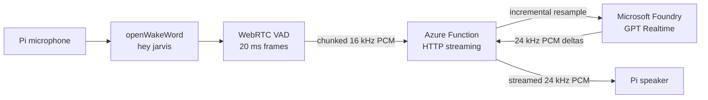

# Architecture

## Runtime path



The Pi owns only physical audio, wake detection, turn termination, and
playback. The Function owns protocol validation, authentication, resampling,
Microsoft Entra token acquisition, and the Realtime session. GPT Realtime owns
speech understanding, response generation, and speech synthesis in one model
session.

## Pi state machine

```text
IDLE_WAKEWORD
  -> ACTIVATED
  -> STREAMING_COMMAND
  -> WAITING_FOR_RESPONSE
  -> PLAYING_RESPONSE
  -> COOLDOWN
  -> IDLE_WAKEWORD
```

- `IDLE_WAKEWORD`: one TFLite model consumes 80 ms microphone frames.
- `ACTIVATED`: play a short local cue.
- `STREAMING_COMMAND`: upload 20 ms PCM frames as they are captured.
- `WAITING_FOR_RESPONSE`: request upload is complete; wait for first audio.
- `PLAYING_RESPONSE`: write each response chunk directly to PortAudio.
- `COOLDOWN`: wait 750 ms to avoid the speaker retriggering the wake word.

The design is half-duplex. No barge-in or wake-word inference runs during a
turn.

## Turn completion and limits

WebRTC VAD cancels an activation if speech does not begin within 3 seconds.
After speech starts, 1.2 seconds of silence closes the request. Regardless of
VAD, 30 seconds (`960,000` input bytes) is a hard ceiling enforced independently
on the Pi and Function.

Azure Functions supports streamed HTTP bodies and responses but is not a
full-duplex WebSocket host. Input reaches Foundry while the Pi is speaking;
Foundry input is committed at request EOF. Response headers are returned only
after the first valid Foundry audio delta, then later deltas stream directly to
the Pi. This removes complete-file buffering without introducing a separate
WebSocket gateway.

## Audio contract

| Direction | Encoding | Frame/chunk strategy |
|---|---|---|
| Pi to Function | PCM16 LE, mono, 16 kHz | 20 ms / 640-byte capture frames |
| Function to Foundry | PCM16 LE, mono, 24 kHz | stateful incremental resampling |
| Function to Pi | PCM16 LE, mono, 24 kHz | streamed model audio deltas |

No WAV container, base64 HTTP body, conversation store, or temporary audio file
exists in the application path. Base64 is used only inside the Foundry
WebSocket protocol.

## Azure resources

The Function runs on Flex Consumption with one always-ready HTTP instance to
avoid normal cold-start latency. Its system-assigned identity accesses the
Functions host Storage account and Foundry. Monitoring uses Application
Insights and Log Analytics. There are no Google, Speech, Key Vault, or
application-database resources.
