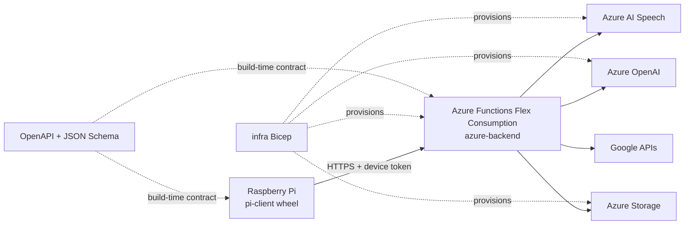

# Architecture

## Deployment boundaries

The monorepo is a developer convenience, not a deployment unit:

- `pi-client` is built into a platform-independent wheel and a small release
  bundle. A Pi downloads only that bundle.
- `azure-backend` is packaged from its own directory with production
  dependencies and prompts. It never includes Pi libraries, assets, or Bicep.
- `infra` provisions Azure resources without building either runtime.
- `contracts` is the only shared boundary. Runtime models are kept within each
  component so neither runtime imports the other.

## Voice turn

1. The Pi detects a wake word or push-to-talk input.
2. Voice activity detection bounds a short in-memory WAV payload.
3. The client sends one authenticated request with an idempotency key.
4. The backend validates the device, transcribes audio when supplied, and
   invokes the assistant orchestrator.
5. Explicitly allowed tools read or mutate todos, reminders, or configured
   Google services.
6. The backend synthesizes the response and returns text plus optional audio.
7. The Pi plays the response and immediately discards temporary audio.

Raw conversation audio is not persisted. Operational logs go to journald on
the Pi and Application Insights in Azure.

## Reliability

- Request IDs and idempotency keys prevent duplicate mutations.
- Time is stored as UTC and interpreted using the device IANA timezone.
- The Pi state machine has explicit offline, listening, processing, speaking,
  and error states.
- Updates preserve `/etc/home-assistant-pi/config.env` and device credentials.
- The updater keeps one rollback version and restores it if systemd cannot keep
  the new process active.
